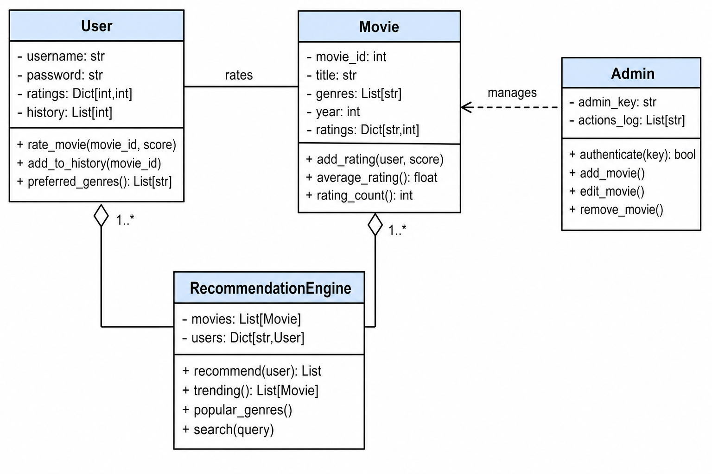

# ITS74004 — Assignment 3
# AI-Based Movie Recommendation System (MRS)

**Application name:** CineMatch
**Technology:** Python · Streamlit · Plotly · Pandas (object-oriented design)

> This document contains the full answers for **Question 1.A** (design) and
> **Question 2.A** (implementation, evidence and deployment). Source code is in
> `app.py`, `models.py` and `data.py`, and is also reproduced in Appendix A.

---

# QUESTION 1.A (15 Marks)

## Task 1.1 — UML Class Diagram (5 Marks)

The MRS is modelled with four core classes: **User**, **Movie**,
**RecommendationEngine** and **Admin**. The diagram below shows their
attributes, methods and relationships.



*(Image file: `assets/uml_class_diagram.png`. A text version is given below in
case the image does not render.)*

```
+---------------------------+        rates        +---------------------------+
|           User            |---------------------|           Movie           |
+---------------------------+                     +---------------------------+
| - username: str           |                     | - movie_id: int           |
| - password: str           |                     | - title: str              |
| - ratings: Dict[int,int]  |                     | - genres: List[str]       |
| - history: List[int]      |                     | - year: int               |
+---------------------------+                     | - ratings: Dict[str,int]  |
| + rate_movie(id, score)   |                     +---------------------------+
| + add_to_history(id)      |                     | + add_rating(user, score) |
| + preferred_genres()      |                     | + average_rating(): float |
+---------------------------+                     | + rating_count(): int     |
           ^                                       +---------------------------+
           | 1..*                                         ^            ^
           |                                              | 1..*       | manages
+---------------------------+                             |            |
|   RecommendationEngine    |-----------------------------+      +-----------+
+---------------------------+                                    |   Admin   |
| - movies: List[Movie]     |                                    +-----------+
| - users: Dict[str,User]   |                                    | - admin_key      |
+---------------------------+                                    | - actions_log    |
| + recommend(user): List   |                                    +-----------+
| + trending(): List[Movie] |                                    | + authenticate() |
| + popular_genres()        |                                    | + add_movie()    |
| + search(query)           |                                    | + edit_movie()   |
+---------------------------+                                    | + remove_movie() |
                                                                 +-----------+
```

### Relationships between the classes

| Relationship | Type | Meaning |
|---|---|---|
| **User — Movie** | Association (`rates`) | A user rates many movies; a movie is rated by many users (many-to-many). The rating value links the two. |
| **RecommendationEngine — User** | Aggregation (`1..*`) | The engine holds a collection of users to build preference profiles, but users exist independently of the engine. |
| **RecommendationEngine — Movie** | Aggregation (`1..*`) | The engine references the full movie catalogue to score and rank candidates. |
| **Admin — Movie** | Dependency (`manages`) | The admin acts on the movie catalogue (create/update/delete) but does not *own* individual movies. |

This separation follows the **single-responsibility principle**: data entities
(`User`, `Movie`) hold state, the `RecommendationEngine` holds the AI/analytics
logic, and `Admin` holds privileged operations.

---

## Task 1.2 — Description of Attributes and Methods (5 Marks)

### Class `Movie`
| Member | Type | Description & rationale |
|---|---|---|
| `movie_id` | attribute | Unique integer key. Needed so ratings/history can reference a film unambiguously even if two films share a title. |
| `title` | attribute | Human-readable name shown in the UI and used by search. |
| `genres` | attribute | List of genre tags — the **feature vector** for content-based recommendation and genre analytics. |
| `year`, `description` | attribute | Metadata for display and richer search. |
| `ratings` | attribute | Maps `username → score`; lets each movie compute its own statistics. |
| `add_rating(user, score)` | method | Records or overwrites a user's rating; encapsulates rating state inside the movie. |
| `average_rating()` | method | Returns the mean score — the headline quality metric used in trending and tie-breaking. |
| `rating_count()` | method | Number of ratings; used to weight trending so popular films aren't beaten by a single 5-star vote. |

### Class `User`
| Member | Type | Description & rationale |
|---|---|---|
| `username` | attribute | Unique login identifier and key in the user store. |
| `password` | attribute | Credential for authentication (stored plainly here for coursework only; production would hash it). |
| `ratings` | attribute | Maps `movie_id → score`; the raw signal the recommender learns from. |
| `history` | attribute | Ordered list of watched movie IDs — powers the watch-log and engagement analytics. |
| `rate_movie(id, score)` | method | Single entry point that stores a rating **and** logs the view, keeping data consistent. |
| `add_to_history(id)` | method | Maintains a de-duplicated, recency-ordered watch list. |
| `preferred_genres()` | method | Aggregates highly-rated genres — a quick, explainable summary of taste. |

### Class `RecommendationEngine`
| Member | Type | Description & rationale |
|---|---|---|
| `movies` | attribute | The candidate pool to recommend from. |
| `users` | attribute | All users, needed for cross-user analytics (e.g. most-watched). |
| `recommend(user)` | method | Core AI: builds a weighted genre profile and ranks unseen movies by cosine similarity + popularity. |
| `trending()` | method | Returns a Bayesian-weighted ranking of top movies for the "trending" feed. |
| `popular_genres()` | method | Aggregates rating volume per genre for insight charts. |
| `search(query)` | method | Case-insensitive lookup across title and genres for Task 2.1. |

### Class `Admin`
| Member | Type | Description & rationale |
|---|---|---|
| `admin_key` | attribute | Secret key gating the admin console (Task 2.3). |
| `actions_log` | attribute | Audit trail of administrative changes for accountability. |
| `authenticate(key)` | method | Validates the supplied key before privileged operations are allowed. |
| `add_movie / edit_movie / remove_movie` | methods | CRUD operations on the catalogue, restricted to administrators. |

**Overall rationale:** attributes capture the minimum *state* each entity needs,
while methods expose *behaviour* through a clean interface. This makes the system
modular, testable and easy to extend (e.g. swapping the recommender for a
collaborative-filtering model touches only `RecommendationEngine`).

---

## Task 1.3 — How the System Analyses Behaviour & Improves Over Time (5 Marks)

**1. Capturing behaviour.** Every interaction is logged: explicit **ratings**
(1–5 stars) and implicit **watch history**. These become the user's behavioural
signal.

**2. Building a preference profile.** For each user, the engine converts rated
movies into genre vectors and combines them into a single weighted
**preference vector**. Ratings are centred around the mid-point (2.5) so that a
1-star rating *pushes the profile away* from that genre while a 5-star rating
*pulls it toward* that genre.

**3. Generating recommendations.** Each unseen movie is scored by **cosine
similarity** between the user profile and the movie's genre vector, plus a small
**popularity** term for tie-breaking:

```
score = 0.85 × cosine(user_profile, movie_genres) + 0.15 × normalised_average_rating
```

The highest-scoring unseen movies are recommended. New users with no ratings hit
a **cold-start fallback** and are shown trending titles until enough signal
exists.

**4. Real-time data updates.** Because ratings and history are written back to
the data store immediately and the engine is rebuilt on each page load, a new
rating instantly reshapes that user's profile — the next set of recommendations
reflects it without any manual retraining step.

**5. How machine learning improves recommendations.** The current engine is a
content-based model, but the architecture is designed to scale up:
- **Collaborative filtering** (matrix factorisation / SVD) can learn latent
  taste factors from the full `users × movies` rating matrix to recommend films
  *similar users* liked, even across genres.
- **Hybrid models** combine content + collaborative signals to overcome
  cold-start and popularity bias.
- **Online learning / periodic retraining** lets the model adapt as tastes and
  the catalogue change, while **A/B testing** measures whether new models
  actually increase engagement (click-through, watch-time, retention).

Because the recommender logic is isolated in the `RecommendationEngine` class,
any of these algorithms can be dropped in without changing the UI or data layer.

---

# QUESTION 2.A (25 Marks)

The system is implemented as an interactive **Streamlit** web application
(`app.py`). Navigation is via the sidebar: **Discover & Rate**, **My Dashboard**
and **Admin Console**.

## Task 2.1 — Rate Movies, Recommendations & Search (5 Marks)

Implemented in `rate_and_search_view()`:
- **Search** — a text box queries title *and* genre (`RecommendationEngine.search`).
- **Browse + genre filter** — the full catalogue with a genre dropdown.
- **Rating** — every movie card has a 1–5 star slider and a *Save rating* button
  that calls `User.rate_movie()`.
- **Recommendations** — after rating, personalised picks appear on the dashboard
  (`RecommendationEngine.recommend`).

**Evidence (screenshot):** *Insert screenshot — "Discover & Rate" page showing a
search result and a rating slider.*

## Task 2.2 — Registered-User Dashboard (10 Marks)

Implemented in `dashboard_view()`:
- **Top recommended movies** — ranked table + horizontal bar chart of match scores.
- **Trending movies** — bar chart of top-rated titles (Bayesian weighting).
- **Popular genres** — donut chart of engagement share by genre.
- **Watch history & rating log** — chronological table of watched films and the
  score the user gave.
- **KPIs** — movies watched, movies rated, average rating given.
- **Data visualisations** — bar charts and a pie/donut chart via Plotly.

**Evidence (screenshots):** *Insert screenshots — KPI row, recommendation bar
chart, trending bar chart, popular-genres donut, and the watch-history table.*

## Task 2.3 — Administrative Console (6 Marks)

Implemented in `admin_view()`, gated by the unique key `ADMIN-2026-MRS`:
- **Add movie** — form for title, genres, year, description (`Admin.add_movie`).
- **Edit / Remove movie** — select a film, update fields or delete it
  (`Admin.edit_movie`, `Admin.remove_movie`).
- **Catalogue table** — live view of all movies with average rating & counts.
- **User-engagement analytics** — *most-watched movies* bar chart, platform KPIs
  (users, movies, total ratings, genres) and a *ratings-by-genre* bar chart.

**Evidence (screenshots):** *Insert screenshots — admin key prompt, add/edit
form, and the "Most-watched movies" engagement chart.*

## Task 2.4 — Streamlit Deployment (4 Marks)

**Deployed Application URL:** `__________________________________________`

**Deployment steps (to complete and paste your live URL above):**

1. Create a **public GitHub repository** and push `app.py`, `models.py`,
   `data.py`, `requirements.txt` and the `.streamlit/` folder.
2. Sign in at **https://share.streamlit.io** with GitHub and click **New app**.
3. Select the repository and branch, and set **Main file path** to `app.py`.
4. Click **Deploy** — Streamlit Community Cloud automatically installs the
   pinned dependencies in `requirements.txt` (`streamlit`, `pandas`, `plotly`);
   no `packages.txt` or `Procfile` is needed because there are no system-level
   or web-server dependencies.
5. Once the build finishes, copy the public `*.streamlit.app` URL and paste it
   above. Verify it loads in an incognito window before submission.

**Brief explanation (3–5 sentences):** *The application was deployed to Streamlit
Community Cloud, which hosts Python apps directly from a public GitHub repository.
The only configuration required was a `requirements.txt` listing the pinned
dependencies (streamlit, pandas, plotly), which the platform installs
automatically during the build. An optional `.streamlit/config.toml` sets the
theme, and the app entry point is `app.py`. No `packages.txt` or `Procfile` was
needed since the app has no system-level packages or custom server. After
deployment the public URL was confirmed to be accessible.*

---

## Demo Credentials

- **Users:** `alice / alice123`, `bob / bob123`, `carol / carol123`
- **Admin key:** `ADMIN-2026-MRS`

## How to run locally

```bash
pip install -r requirements.txt
streamlit run app.py
# open http://localhost:8501
```

---

# Appendix A — Source Code

The complete source is in the accompanying Python files:
- `models.py` — `Movie`, `User`, `RecommendationEngine`, `Admin`
- `data.py` — seed catalogue, demo users, JSON persistence
- `app.py` — Streamlit UI for all user journeys

Copy these files into your submission document or attach them as separate
`.py` files as required by the assessment guidelines.
